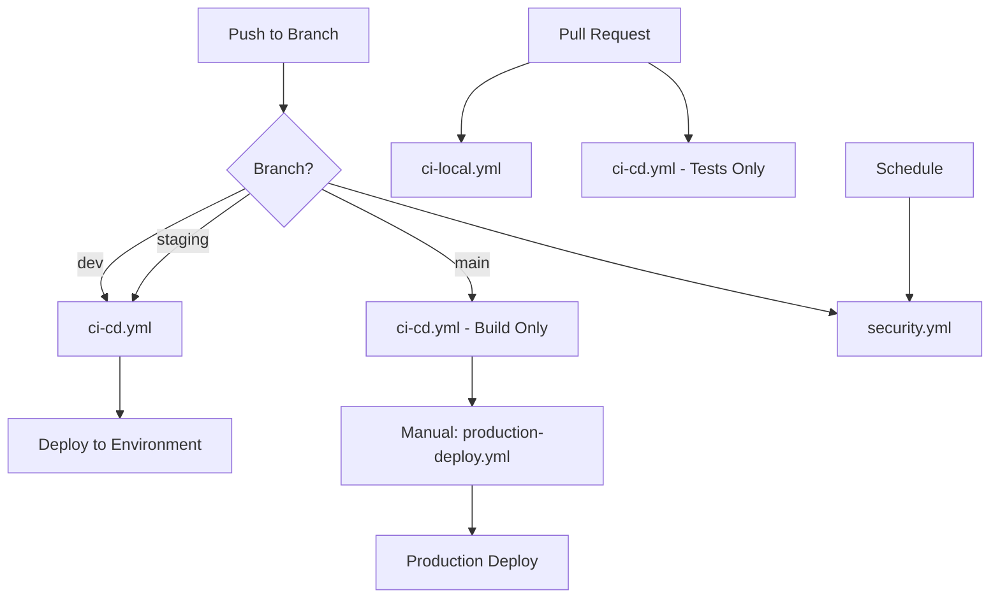

# GitHub Actions Workflow Strategy

## Workflow Overview

We use multiple specialized workflows for different purposes:

### 1. `ci-local.yml` (Local Docker Testing)
**Purpose:** Validates the Docker Compose setup and runs tests in containerized environment
**When to use:** 
- Testing Docker configuration changes
- Validating local development environment
- Pull requests that modify Docker files

**Triggers:**
- Pull requests to main/dev/staging
- Manual dispatch

**What it does:**
- Builds and caches Docker images
- Runs tests in Docker Compose environment
- Validates migrations
- Checks Celery workers

### 2. `ci-cd.yml` (Main CI/CD Pipeline)
**Purpose:** Production deployment pipeline with comprehensive testing
**When to use:**
- Deploying to AWS ECS
- Production-ready builds
- Automated deployments

**Triggers:**
- Push to main/dev/staging branches
- Pull requests (tests only, no deployment)
- Manual dispatch with environment selection

**What it does:**
- Runs native Python tests (faster than Docker)
- Security scanning
- Builds and pushes to ECR
- Deploys to ECS
- Runs database migrations
- Performs smoke tests

### 3. `production-deploy.yml` (Production Deployment)
**Purpose:** Controlled production deployments with approval gates
**When to use:**
- Production releases only
- Rollback scenarios
- Multi-tenant deployments

**Triggers:**
- Manual dispatch only (requires approval)

**What it does:**
- Requires manual approval
- Creates backups before deployment
- Blue-green deployment
- Automatic rollback on failure
- Audit logging

### 4. `security.yml` (Security Scanning)
**Purpose:** Comprehensive security analysis
**When to use:**
- Daily security checks
- Before production releases
- Security audit requirements

**Triggers:**
- Daily schedule
- Push to main/dev/staging
- Manual dispatch

**What it does:**
- Container vulnerability scanning
- Dependency security checks
- SAST analysis
- Infrastructure security scanning
- License compliance

## Choosing the Right Workflow

### For Development:
1. Make changes locally
2. `ci-local.yml` runs on PR to validate Docker setup
3. `ci-cd.yml` runs tests and deploys to dev environment

### For Staging:
1. Merge to staging branch
2. `ci-cd.yml` automatically deploys to staging
3. `security.yml` runs security checks

### For Production:
1. Merge to main branch
2. `ci-cd.yml` builds and tests
3. Manually trigger `production-deploy.yml`
4. Approve deployment
5. Monitor rollout

## Migration from Old CI

### What changed:
- **Old `ci.yml`**: Docker Compose only, no deployment
- **New `ci-local.yml`**: Enhanced Docker Compose testing
- **New `ci-cd.yml`**: Full deployment pipeline
- **Added**: Security scanning, production controls, audit logging

### Transition Plan:
1. Keep `ci-local.yml` for Docker validation
2. Use `ci-cd.yml` for deployments
3. Remove old `ci.yml` after validation

## Performance Optimizations

### Test Performance:
- **ci-local.yml**: ~5-7 minutes (Docker overhead)
- **ci-cd.yml**: ~3-4 minutes (native Python with services)

### Caching Strategy:
- Docker layer caching via GitHub Actions cache
- Python dependency caching
- ECR image layer caching

### Parallelization:
- Matrix builds for multiple services
- Concurrent security scans
- Parallel deployment to ECS services

## Best Practices

1. **Use the right workflow for the task**
   - Don't use production workflow for dev deployments
   - Don't skip security scans for production

2. **Leverage caching**
   - Docker builds are cached
   - Python dependencies are cached
   - Reuse layers when possible

3. **Monitor workflow duration**
   - Set timeout limits
   - Cancel redundant runs
   - Use concurrency groups

4. **Review before production**
   - Always run security scans
   - Require approval for production
   - Test in staging first

## Workflow Dependencies

## Troubleshooting

### If ci-local.yml fails:
- Check Docker Compose configuration
- Verify service dependencies
- Review Docker build cache

### If ci-cd.yml fails:
- Check test failures
- Verify AWS credentials
- Review ECS deployment logs

### If production-deploy.yml fails:
- Check approval status
- Verify backup creation
- Review rollback logs
- Check CloudWatch for errors