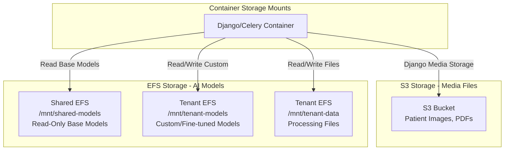
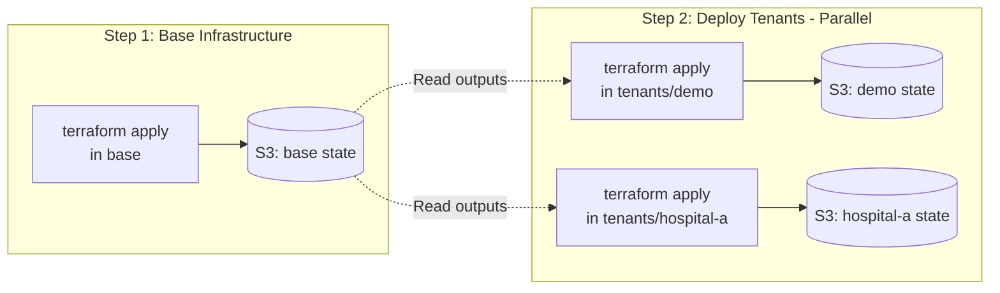
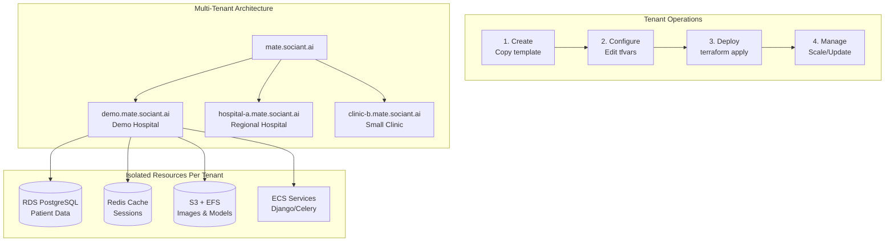

# MATE Platform Documentation

## 🚀 Quick Start

**First Time Setup?** Follow these steps in order:
1. [Configure AWS CLI & Profiles](#-aws-cli-configuration)
2. [Deploy Base Infrastructure](#-infrastructure-deployment)
3. [Deploy Your First Tenant](#deploy-demo-tenant)

## 📚 Documentation Structure

### Infrastructure & Deployment

#### **NEW: Separated Deployment Architecture** 🎯
Our infrastructure now uses a **separated deployment model** where base infrastructure and tenants are deployed independently. This means:
- **Zero-risk tenant deployments** - Adding/updating tenants can't break others
- **Parallel deployments** - Deploy multiple hospitals simultaneously  
- **Independent rollbacks** - Issues with one tenant don't affect others
- **Clear cost tracking** - Each tenant has its own state file

```mermaid
graph TB
    subgraph "Base Infrastructure (Deploy Once)"
        VPC[VPC & Networking]
        ECS[ECS Cluster]
        ECR[ECR Repositories]
        COGNITO[Cognito User Pool]
        SHARED_EFS[Shared EFS<br/>Base AI Models]
        KMS[KMS Encryption]
        WAF[WAF Protection]
    end
    
    subgraph "Tenant A (Independent)"
        A_RDS[RDS PostgreSQL]
        A_REDIS[ElastiCache Redis]
        A_S3[S3 Buckets]
        A_EFS[Tenant EFS<br/>Custom Models]
        A_ALB[Load Balancer]
        A_ECS[ECS Services<br/>Django + Celery]
    end
    
    subgraph "Tenant B (Independent)"
        B_RDS[RDS PostgreSQL]
        B_REDIS[ElastiCache Redis]
        B_S3[S3 Buckets]
        B_EFS[Tenant EFS]
        B_ALB[Load Balancer]
        B_ECS[ECS Services]
    end
    
    VPC --> A_RDS & A_REDIS & B_RDS & B_REDIS
    ECS --> A_ECS & B_ECS
    SHARED_EFS -.->|Read Only| A_ECS & B_ECS
    A_EFS -->|Read/Write| A_ECS
    B_EFS -->|Read/Write| B_ECS
```



```
infrastructure/
├── terraform/
│   ├── base/                # Shared infrastructure (VPC, ECS, etc.)
│   └── tenants/             # Individual tenant deployments
│       ├── demo/            # Each tenant deployed separately
│       └── hospital-a/      # Independent state & resources
└── iam/                     # IAM policies for deployment
```

### AWS Deployment Guides

1. **[Initial AWS Setup](./aws/01-initial-setup.md)**
   - AWS account creation & MFA setup
   - IAM configuration with proper policies
   - Tool installation (AWS CLI, Terraform, Docker)
   - Initial infrastructure deployment

2. **[Deployment & Operations](./aws/02-deployment-guide.md)**
   - Tenant provisioning with new separated model
   - Daily operations & monitoring
   - Maintenance procedures
   - Troubleshooting guide

3. **[Terraform Reference](./aws/03-terraform-reference.md)**
   - Module documentation
   - Configuration options for base vs tenant
   - Infrastructure customization
   - State management best practices

4. **[Security & Compliance](./aws/04-security-compliance.md)**
   - HIPAA compliance checklist
   - Security best practices
   - Audit and logging with CloudTrail
   - Encryption at rest and in transit

5. **[Cost Management](./aws/05-cost-optimization.md)**
   - Cost tracking per tenant (~$65-100/month per tenant)
   - Optimization strategies (NAT Gateway, ECS scaling)
   - Reserved instances and savings plans
   - Tenant tier pricing models

### Local Development

1. **[Local Setup Guide](./local/01-setup.md)**
   - Docker installation
   - Environment configuration
   - Database initialization

2. **[Development Workflow](./local/02-development.md)**
   - Code style and linting
   - Testing strategies
   - Debugging tips

3. **[Frontend Development](./local/03-frontend.md)**
   - Vite configuration
   - React components
   - Asset management

### Architecture Documentation

1. **[Multi-Tenant Architecture](./architecture/01-multi-tenant.md)**
   - **AWS-level isolation** (not Django schemas)
   - Each tenant gets isolated: RDS, Redis, S3, EFS
   - Shared EFS for base AI models
   - Tenant identification & routing

2. **[Storage Architecture](./architecture/02-storage.md)** 
   - **Three-tier EFS strategy**:
     - Shared base models (read-only for all)
     - Tenant custom models (per-tenant write)
     - Tenant data files (completely isolated)
   - S3 for media files vs EFS for models
   - Cost optimization strategies



3. **[Database Design](./architecture/03-database.md)**
   - Isolated RDS instances per tenant
   - Schema design & migrations
   - Performance optimization

## 🛠️ AWS CLI Configuration

### Setting Up AWS Profiles

```bash
# Configure default profile
aws configure
# Enter: Access Key ID, Secret Access Key, Region (us-east-1), Output (json)

# Configure named profile for production
aws configure --profile mate-production

# Configure MFA-enabled profile (recommended)
aws configure set mfa_serial arn:aws:iam::528424611228:mfa/your-username --profile mate-mfa
```

### Using MFA with AWS CLI

```bash
# Get temporary credentials with MFA
aws sts get-session-token \
  --serial-number arn:aws:iam::528424611228:mfa/your-username \
  --token-code 123456 \
  --duration-seconds 43200

# Export the credentials
export AWS_ACCESS_KEY_ID=<temporary-access-key>
export AWS_SECRET_ACCESS_KEY=<temporary-secret-key>
export AWS_SESSION_TOKEN=<session-token>
```

**Pro Tip**: Use [aws-vault](https://github.com/99designs/aws-vault) for automatic MFA handling:
```bash
# Install aws-vault
brew install aws-vault  # macOS
# or download from GitHub releases

# Add profile with MFA
aws-vault add mate-production

# Execute commands with automatic MFA
aws-vault exec mate-production -- terraform apply
```

### Updating IAM Policies

```bash
# Update existing policy
aws iam create-policy-version \
  --policy-arn arn:aws:iam::528424611228:policy/MATE-Terraform-Deploy \
  --policy-document file://infrastructure/iam/terraform-deploy-policy.json \
  --set-as-default

# List policy versions
aws iam list-policy-versions \
  --policy-arn arn:aws:iam::528424611228:policy/MATE-Terraform-Deploy

# Delete old versions (max 5 versions allowed)
aws iam delete-policy-version \
  --policy-arn arn:aws:iam::528424611228:policy/MATE-Terraform-Deploy \
  --version-id v1
```

## 🏗️ Infrastructure Deployment

### Base Infrastructure Configuration

The base infrastructure creates shared resources used by all tenants. Configure in `infrastructure/terraform/base/terraform.tfvars`:

#### Base Infrastructure Variables

| Variable | Description | Default | Example |
|----------|-------------|---------|---------|
| `environment` | Environment name (dev/staging/production) | Required | `"dev"` |
| `aws_region` | AWS region for deployment | `"us-east-1"` | `"us-west-2"` |
| `vpc_cidr` | CIDR block for VPC | `"10.0.0.0/16"` | `"172.16.0.0/16"` |
| `domain_name` | Base domain for all tenants | Required | `"mate.sociant.ai"` |
| `create_route53_zone` | Create new Route53 zone? | `false` | `true` |
| `cognito_domain` | Cognito auth domain prefix | Required | `"mate-sociant-auth"` |
| `cost_center` | Tag for cost allocation | `"engineering"` | `"healthcare-it"` |
| `enable_deletion_protection` | Protect RDS from deletion | `true` | `false` for dev |

#### What Base Infrastructure Creates:
- **VPC**: 3 public subnets, 3 private subnets, 1 NAT Gateway
- **ECS Cluster**: Shared container orchestration platform
- **ECR Repositories**: Docker image storage (mate-web, mate-celery, mate-beat)
- **Cognito User Pool**: Centralized authentication
- **WAF**: Web application firewall rules
- **KMS Key**: Encryption key for all resources
- **Shared EFS**: Base AI models accessible by all tenants
- **Route53 Zone**: DNS management (if create_route53_zone=true)
- **ACM Certificate**: SSL certificate for *.mate.sociant.ai

### Deploy Base Infrastructure (One Time)

```bash
cd infrastructure/terraform/base/
terraform init
terraform plan -out=tfplan
terraform apply tfplan

# Cost: ~$52/month (mainly NAT Gateway)
```

### Tenant Configuration Options

Each tenant can be customized extensively through `terraform.tfvars`. Here are ALL available options:

#### Core Tenant Settings

| Variable | Description | Default | Options/Range |
|----------|-------------|---------|---------------|
| `display_name` | Human-readable name | Required | Any string |
| `subdomain` | URL subdomain | Required | `"demo"` → demo.mate.sociant.ai |
| `tier` | Pricing tier | Required | `"trial"`, `"standard"`, `"enterprise"` |

#### RDS PostgreSQL Configuration

| Variable | Description | Default | Options |
|----------|-------------|---------|---------|
| `rds_instance_class` | Database instance size | Tier-based | `"db.t4g.micro"` (~$15/mo), `"db.t4g.small"` (~$30/mo), `"db.t4g.medium"` (~$60/mo), `"db.r6g.large"` (~$120/mo) |
| `rds_allocated_storage` | Initial storage in GB | `20` | `20-65536` |
| `rds_max_storage` | Auto-scaling max GB | `100` | Must be > allocated_storage |
| `rds_backup_retention` | Backup retention days | `7` | `0-35` (0 = no backups) |
| `rds_multi_az` | High availability | `false` | `true` doubles RDS cost |

#### Redis ElastiCache Configuration

| Variable | Description | Default | Options |
|----------|-------------|---------|---------|
| `redis_node_type` | Cache instance size | Tier-based | `"cache.t4g.micro"` (~$13/mo), `"cache.t4g.small"` (~$25/mo), `"cache.r7g.large"` (~$100/mo) |
| `redis_num_cache_nodes` | Number of nodes | `1` | `1-6` (>1 enables failover) |
| `redis_backup_retention` | Snapshot retention days | `0` | `0-35` |

#### ECS Container Configuration

| Variable | Description | Default | Options |
|----------|-------------|---------|---------|
| `django_desired_count` | Web container count | `1` | `1-100` |
| `django_cpu` | CPU units (1024 = 1 vCPU) | `256` | `256`, `512`, `1024`, `2048`, `4096` |
| `django_memory` | Memory in MB | `512` | `512`, `1024`, `2048`, `4096`, `8192` |
| `celery_desired_count` | Worker container count | `1` | `1-100` |
| `celery_cpu` | Worker CPU units | `256` | Same as django_cpu |
| `celery_memory` | Worker memory MB | `512` | Same as django_memory |

#### Auto-Scaling Configuration

| Variable | Description | Default | Options |
|----------|-------------|---------|---------|
| `enable_autoscaling` | Enable auto-scaling | `false` | `true`/`false` |
| `min_capacity` | Minimum containers | `1` | `1-100` |
| `max_capacity` | Maximum containers | `3` | Must be > min_capacity |
| `target_cpu_utilization` | CPU target % | `75` | `1-100` |

#### Storage Configuration

| Variable | Description | Default | Options |
|----------|-------------|---------|---------|
| `s3_versioning` | Version all S3 objects | `true` | Required for HIPAA |
| `s3_lifecycle_rules` | Archive old data | `false` | `true` saves costs |
| `efs_throughput_mode` | EFS performance | `"bursting"` | `"bursting"` (cheap), `"provisioned"` (guaranteed) |
| `efs_throughput_mibps` | Provisioned throughput | `null` | `1-1024` (only if provisioned) |
| `max_storage_gb` | Storage quota | `100` | Any number |

#### HIPAA Compliance Settings

| Variable | Description | Default | Options |
|----------|-------------|---------|---------|
| `hipaa_compliant` | Enable HIPAA features | `false` | `true` for production |
| `enable_audit_logging` | CloudTrail logging | `false` | `true` adds ~$5/mo |
| `enable_flow_logs` | VPC flow logs | `false` | `true` adds ~$10/mo |
| `data_retention_days` | Keep data for X days | `90` | `2555` (7 years) for HIPAA |

#### Identity Provider (SSO)

| Variable | Description | Example |
|----------|-------------|---------|
| `identity_provider` | SSO configuration | `null` for Cognito only |
| `identity_provider.type` | SSO type | `"SAML"` or `"OIDC"` |
| `identity_provider.name` | Provider name | `"HospitalAzureAD"` |
| `identity_provider.metadata_url` | SAML metadata | `"https://login.microsoftonline.com/..."` |

#### Contact & Billing

| Variable | Description | Required | Example |
|----------|-------------|----------|---------|
| `technical_contact` | Tech contact email | Yes | `"it@hospital.com"` |
| `billing_contact` | Billing email | Yes | `"finance@hospital.com"` |
| `cost_center` | Cost allocation tag | No | `"radiology"` |
| `department` | Department tag | No | `"imaging"` |

### Tenant Deployment



#### Deploy Demo Tenant
```bash
cd infrastructure/terraform/tenants/demo/
terraform init
terraform plan -out=tfplan
terraform apply tfplan

# Access at: https://demo.mate.sociant.ai
# Cost: ~$65/month
```

#### Add New Hospital (Template Method)
```bash
# Copy template
cp -r infrastructure/terraform/tenants/template infrastructure/terraform/tenants/hospital-xyz

# Update configuration
cd infrastructure/terraform/tenants/hospital-xyz
vim main.tf  # Change TENANT_NAME in backend block
vim terraform.tfvars  # Configure hospital details

# Deploy independently
terraform init
terraform plan -out=tfplan
terraform apply tfplan
```

#### Example Configurations by Tier

**Minimal Trial Tier** (~$65/month):
```hcl
tenant_config = {
  display_name = "Small Clinic"
  subdomain    = "clinic"
  tier         = "trial"
  
  # Minimal resources
  rds_instance_class    = "db.t4g.micro"
  django_cpu           = 256
  django_memory        = 512
  redis_node_type      = "cache.t4g.micro"
  
  # Basic compliance
  hipaa_compliant      = true
  enable_audit_logging = false  # Save costs
  
  technical_contact = "admin@clinic.com"
  billing_contact   = "admin@clinic.com"
}
```

**Standard Production** (~$150/month):
```hcl
tenant_config = {
  display_name = "Regional Hospital"
  subdomain    = "regional"
  tier         = "standard"
  
  # Production resources
  rds_instance_class    = "db.t4g.small"
  rds_multi_az         = true
  django_desired_count = 2
  django_cpu          = 512
  django_memory       = 1024
  redis_num_cache_nodes = 2
  
  # Auto-scaling
  enable_autoscaling     = true
  min_capacity          = 2
  max_capacity          = 5
  
  # Full compliance
  hipaa_compliant      = true
  enable_audit_logging = true
  data_retention_days  = 2555  # 7 years
  
  technical_contact = "it@hospital.com"
  billing_contact   = "finance@hospital.com"
}
```

**Enterprise with SSO** (~$500/month):
```hcl
tenant_config = {
  display_name = "Medical Center"
  subdomain    = "medcenter"
  tier         = "enterprise"
  
  # High-performance resources
  rds_instance_class    = "db.r6g.large"
  rds_allocated_storage = 100
  rds_multi_az         = true
  django_desired_count = 5
  django_cpu          = 2048
  django_memory       = 4096
  celery_desired_count = 3
  redis_node_type      = "cache.r7g.large"
  
  # Advanced features
  enable_autoscaling   = true
  max_capacity        = 20
  s3_lifecycle_rules  = true
  efs_throughput_mode = "provisioned"
  efs_throughput_mibps = 100
  
  # SSO Integration
  identity_provider = {
    type = "SAML"
    name = "MedCenterAzureAD"
    metadata_url = "https://login.microsoftonline.com/tenant-id/federationmetadata/2007-06/federationmetadata.xml"
  }
  
  # Full compliance
  hipaa_compliant     = true
  enable_audit_logging = true
  enable_flow_logs    = true
  
  technical_contact = "cto@medcenter.org"
  billing_contact   = "cfo@medcenter.org"
  cost_center      = "it-infrastructure"
  department       = "radiology"
}
```

### Cost-Saving Tips

```bash
# Destroy demo when not testing (saves $65/month)
cd infrastructure/terraform/tenants/demo
terraform destroy

# Destroy NAT Gateway when not needed (saves $45/month)
cd infrastructure/terraform/base
terraform destroy -target=module.vpc.aws_nat_gateway.main
```

## 🔐 Security Best Practices

### AWS Account Security
1. **Enable MFA on root account** - Required as of 2025
2. **Use IAM roles over access keys** - For production workloads
3. **Enable CloudTrail** - Audit all API calls
4. **Rotate credentials** - Every 90 days
5. **Use AWS Organizations** - Separate accounts for prod/dev

### Terraform State Security
```bash
# Enable S3 versioning (already configured)
aws s3api put-bucket-versioning \
  --bucket mate-terraform-state-528424611228 \
  --versioning-configuration Status=Enabled

# Enable S3 encryption (already configured)
aws s3api put-bucket-encryption \
  --bucket mate-terraform-state-528424611228 \
  --server-side-encryption-configuration file://encryption.json

# Lock state during operations (automatic with DynamoDB)
```

### Secrets Management
```bash
# Never commit secrets! Use AWS Secrets Manager
aws secretsmanager create-secret \
  --name mate/demo/database-password \
  --secret-string "$(openssl rand -base64 32)"

# Retrieve in application
aws secretsmanager get-secret-value \
  --secret-id mate/demo/database-password \
  --query SecretString --output text
```

## 💡 Pro Tips & Tricks

### Terraform Tips

```bash
# Target specific resources for faster development
terraform apply -target=module.tenant.aws_ecs_service.django

# Import existing resources
terraform import module.tenant.aws_s3_bucket.tenant_data demo-mate-data

# Show current state
terraform state list
terraform state show module.tenant.aws_rds_instance.tenant

# Move resources between state files
terraform state mv module.old_name module.new_name

# Validate configuration
terraform validate
terraform fmt -recursive  # Format all files
```

### AWS CLI Productivity

```bash
# Use JQ for JSON parsing
aws ec2 describe-instances | jq '.Reservations[].Instances[].InstanceId'

# Monitor costs
aws ce get-cost-and-usage \
  --time-period Start=2025-01-01,End=2025-01-31 \
  --granularity MONTHLY \
  --metrics "UnblendedCost" \
  --group-by Type=TAG,Key=Tenant

# Quick ECS logs
aws logs tail /ecs/mate-dev --follow --filter-pattern ERROR

# List all resources with specific tag
aws resourcegroupstaggingapi get-resources \
  --tag-filters Key=Tenant,Values=demo

# Check service health
aws ecs describe-services \
  --cluster mate-dev \
  --services demo-django \
  --query 'services[0].deployments'
```

### Docker & ECR

```bash
# Login to ECR
aws ecr get-login-password --region us-east-1 | \
  docker login --username AWS --password-stdin 528424611228.dkr.ecr.us-east-1.amazonaws.com

# Build and push
docker build -t mate-web .
docker tag mate-web:latest 528424611228.dkr.ecr.us-east-1.amazonaws.com/mate-web:latest
docker push 528424611228.dkr.ecr.us-east-1.amazonaws.com/mate-web:latest

# Clean up old images
aws ecr list-images --repository-name mate-web \
  --query 'imageIds[?imageTag==`null`]' | \
  jq '.[] | {imageDigest:.imageDigest}' | \
  aws ecr batch-delete-image --repository-name mate-web --image-ids file:///dev/stdin
```

### Monitoring & Debugging

```bash
# SSH into ECS container (requires Session Manager)
aws ecs execute-command \
  --cluster mate-dev \
  --task <task-arn> \
  --container django \
  --interactive \
  --command "/bin/bash"

# Force new deployment
aws ecs update-service \
  --cluster mate-dev \
  --service demo-django \
  --force-new-deployment

# Check RDS slow query log
aws rds download-db-log-file-portion \
  --db-instance-identifier demo-mate-db \
  --log-file-name slowquery/mysql-slowquery.log
```

## 🏥 Tenant Management



### Tenant Tiers & Pricing

| Tier | Infrastructure Cost | Suggested Price | Margin | Features |
|------|-------------------|-----------------|---------|----------|
| **Starter** | $65/month | Free-$99 | Loss leader | Basic segmentation, shared models |
| **Professional** | $150/month | $1,000/month | 85% | Custom models, auto-scaling |
| **Enterprise** | $500/month | $8,000+/month | 94% | GPU inference, unlimited scaling |

### Common Operations

```bash
# Check tenant status
cd infrastructure/terraform/tenants/demo
terraform output tenant_url

# Update tenant configuration
vim terraform.tfvars  # Edit settings
terraform plan
terraform apply

# Scale tenant resources
terraform apply -var="django_desired_count=3"

# Emergency shutdown (keeps data)
aws ecs update-service --cluster mate-dev --service demo-django --desired-count 0
```

## 📊 Dashboards & Monitoring

### CloudWatch Dashboard Setup
```bash
# Create dashboard for tenant
aws cloudwatch put-dashboard \
  --dashboard-name MATE-Demo \
  --dashboard-body file://dashboards/tenant-dashboard.json
```

### Key Metrics to Monitor
- **ECS**: CPU/Memory utilization, task count
- **RDS**: CPU, connections, storage, IOPS
- **Redis**: CPU, memory, evictions
- **ALB**: Request count, target health, latency
- **S3**: Bucket size, request metrics
- **Costs**: Daily spend per service

## 🚨 Troubleshooting

### Common Issues

**Terraform State Lock**
```bash
# Force unlock (use carefully!)
terraform force-unlock <lock-id>

# Check DynamoDB for locks
aws dynamodb scan --table-name mate-terraform-locks
```

**ECS Task Failures**
```bash
# Check task stopped reason
aws ecs describe-tasks \
  --cluster mate-dev \
  --tasks <task-arn> \
  --query 'tasks[0].stoppedReason'

# View container logs
aws logs get-log-events \
  --log-group-name /ecs/mate-dev \
  --log-stream-name ecs/django/<task-id>
```

**Database Connection Issues**
```bash
# Test connection
aws rds describe-db-instances \
  --db-instance-identifier demo-mate-db \
  --query 'DBInstances[0].Endpoint'

# Check security groups
aws ec2 describe-security-groups \
  --group-ids <sg-id> \
  --query 'SecurityGroups[0].IpPermissions'
```

## 📖 External Resources

### AWS Documentation
- [AWS ECS Best Practices Guide](https://docs.aws.amazon.com/AmazonECS/latest/bestpracticesguide/)
- [AWS Well-Architected Framework](https://aws.amazon.com/architecture/well-architected/)
- [HIPAA on AWS](https://aws.amazon.com/compliance/hipaa-compliance/)
- [AWS Security Best Practices](https://aws.amazon.com/security/best-practices/)

### Terraform Resources
- [Terraform AWS Provider](https://registry.terraform.io/providers/hashicorp/aws/latest/docs)
- [Terraform Best Practices](https://www.terraform-best-practices.com/)
- [Terraform State Management](https://developer.hashicorp.com/terraform/language/state)

### Django & Python
- [Django Documentation](https://docs.djangoproject.com/)
- [Django Cookiecutter](https://github.com/cookiecutter/cookiecutter-django)
- [Celery Documentation](https://docs.celeryproject.org/)

### Healthcare Compliance
- [HIPAA Security Rule](https://www.hhs.gov/hipaa/for-professionals/security/index.html)
- [NIST 800-66](https://csrc.nist.gov/publications/detail/sp/800-66/rev-2/final)
- [AWS HIPAA Whitepaper](https://docs.aws.amazon.com/whitepapers/latest/architecting-hipaa-security-and-compliance-on-aws/welcome.html)

## 🤝 Contributing to Documentation

When adding new documentation:

1. **Use clear file naming**: `01-topic-name.md` (numbered for ordering)
2. **Include practical examples**: Real commands that work
3. **Add diagrams**: Use [Mermaid](https://mermaid.js.org/) for architecture diagrams
4. **Test your commands**: Ensure all CLI examples actually work
5. **Link related docs**: Cross-reference other relevant documentation
6. **Update this index**: Keep the main README current

## 📞 Support & Help

- **GitHub Issues**: [Report bugs or request features](https://github.com/your-org/mate/issues)
- **AWS Support**: Via AWS Console for infrastructure issues
- **Security Issues**: Email security@your-domain.com (do not post publicly)

---

*Last Updated: January 2025 | Version: 2.0 (Separated Deployment Architecture)*