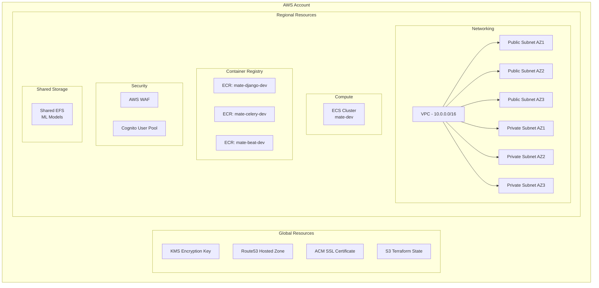
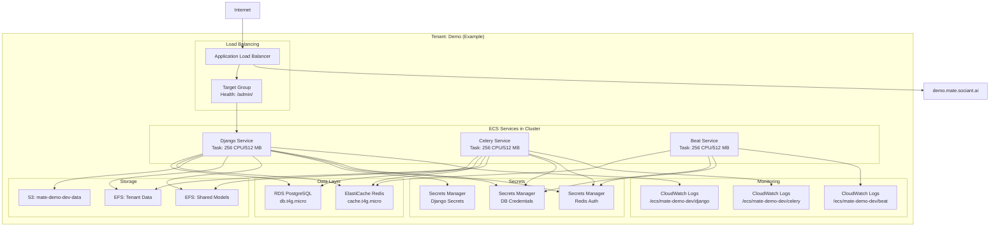
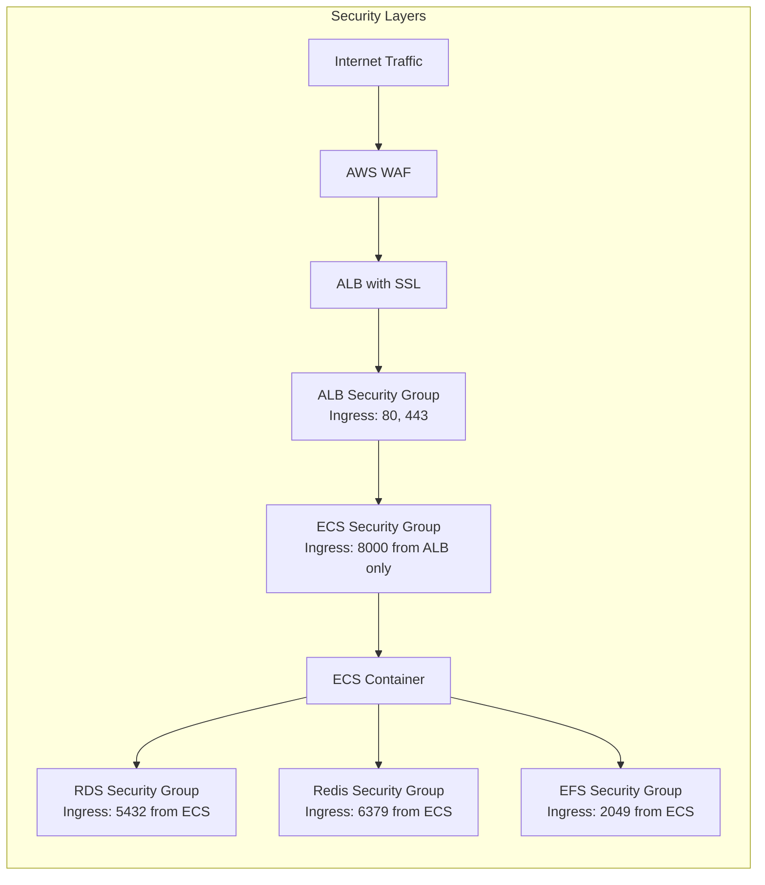
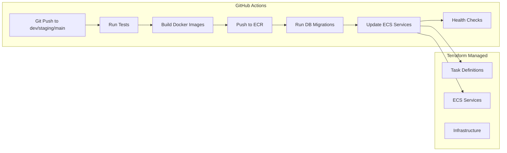
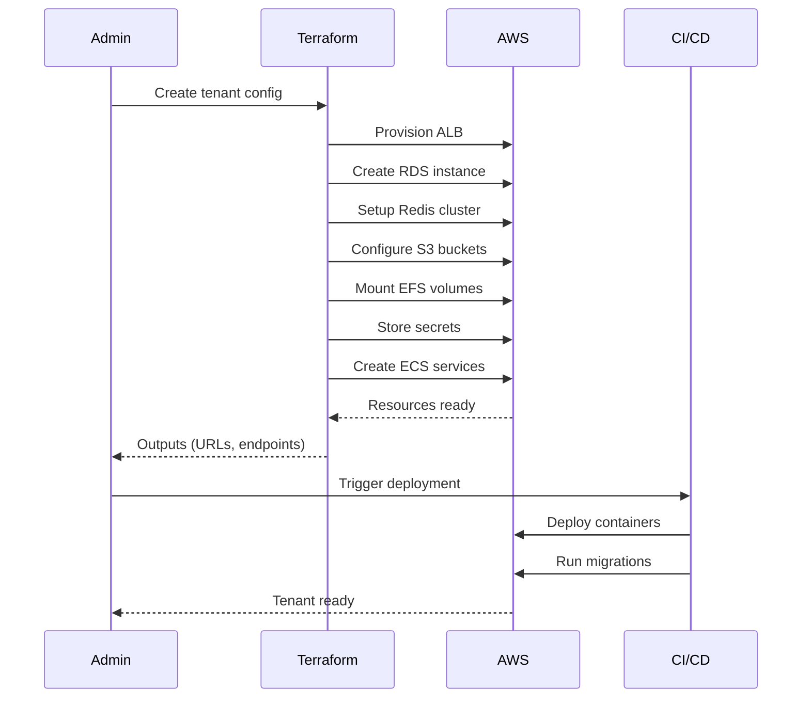

# MATE Infrastructure Architecture Report
## DevOps Meeting Documentation

---

## 📊 Architecture Overview

The MATE infrastructure uses a **two-tier Terraform architecture**:
1. **Base Infrastructure** - Shared resources across all tenants
2. **Tenant Infrastructure** - Isolated resources per customer

---

## 🏗️ Base Infrastructure (`terraform/base/main.tf`)

### Core Components



### Key Features
- **Terraform State**: Stored in S3 with DynamoDB locking
- **Encryption**: All resources encrypted with KMS
- **Networking**: Multi-AZ VPC with public/private subnets
- **Container Registry**: Separate ECR repos per service type
- **Authentication**: Cognito for user management (optional)
- **Security**: WAF for API protection

---

## 🏢 Tenant Infrastructure (`terraform/base/modules/tenant/`)

### Per-Tenant Architecture



### Tenant Tiers Configuration

| Tier | RDS Instance | Redis Node | Django Resources | Celery Resources | Beat Resources |
|------|--------------|------------|------------------|------------------|----------------|
| **Trial** | db.t4g.micro | cache.t4g.micro | 256 CPU / 512 MB | 256 CPU / 512 MB | 256 CPU / 512 MB |
| **Standard** | db.t4g.medium | cache.t4g.small | 512 CPU / 1024 MB | 512 CPU / 1024 MB | 256 CPU / 512 MB |
| **Enterprise** | db.r6g.xlarge | cache.r7g.large | 1024 CPU / 2048 MB | 1024 CPU / 2048 MB | 512 CPU / 1024 MB |

---

## 🔒 Security Architecture



### Security Features
- **Network Isolation**: Each tenant has dedicated security groups
- **Secrets Management**: AWS Secrets Manager for credentials
- **Encryption**:
  - At-rest: KMS encryption for RDS, EFS, S3
  - In-transit: TLS for Redis, HTTPS for ALB
- **Access Control**: IAM roles for ECS tasks
- **HIPAA Compliance**: Optional audit logging to S3

---

## 🚀 CI/CD Pipeline Integration



### Deployment Flow
1. **CI/CD owns**: Docker images, deployments, migrations
2. **Terraform owns**: Infrastructure, task definitions, service configurations
3. **Image Tags**: `branch-shortSHA` format (e.g., `dev-f539de6`)

---

## 📁 Directory Structure

```
infrastructure/terraform/
├── base/                    # Shared infrastructure
│   ├── main.tf             # Core resources
│   ├── variables.tf        # Input variables
│   ├── outputs.tf          # Exported values
│   └── modules/
│       ├── vpc/            # Network configuration
│       ├── ecs_cluster/    # ECS cluster setup
│       ├── ecr/            # Container registries
│       ├── cognito/        # Authentication
│       ├── waf/            # Web Application Firewall
│       ├── shared_resources/
│       └── tenant/         # Tenant module definition
│           ├── main.tf     # ALB, Route53, core setup
│           ├── ecs.tf      # Task definitions, services
│           ├── rds.tf      # PostgreSQL database
│           ├── redis.tf    # ElastiCache Redis
│           ├── s3.tf       # Object storage
│           ├── efs.tf      # Shared file systems
│           └── secrets.tf  # Secrets Manager
│
└── tenants/                # Tenant configurations
    ├── demo/              # Demo tenant
    │   ├── main.tf        # Calls tenant module
    │   ├── terraform.tfvars
    │   └── outputs.tf
    └── production/        # Production tenants
```

---

## 🔄 Tenant Provisioning Process



---

## 💰 Cost Optimization

### Multi-Tenant Efficiency
- **Shared ECS Cluster**: All tenants share compute capacity
- **Shared EFS for ML Models**: Common models stored once
- **Tier-based Scaling**: Resources match customer needs
- **Spot Instances**: Can be enabled for non-critical workloads

### Per-Tenant Costs (Estimated Monthly)

| Component | Trial Tier | Standard Tier | Enterprise Tier |
|-----------|------------|---------------|-----------------|
| ALB | $20 | $20 | $20 |
| ECS Tasks | $15 | $30 | $60 |
| RDS | $15 | $30 | $200 |
| Redis | $15 | $25 | $100 |
| S3/EFS | $5 | $20 | $100 |
| **Total** | **$70** | **$125** | **$480** |

---

## 🎯 Key Design Decisions

### 1. **Terraform State Management**
- Centralized S3 backend with DynamoDB locking
- Separate state files for base and each tenant
- Enables team collaboration and prevents conflicts

### 2. **Security Group Architecture**
- Layered security with minimal exposed ports
- ALB only accepts 80/443 from internet
- ECS only accepts 8000 from ALB
- Databases only accept connections from ECS

### 3. **Container Strategy**
- Single Docker image used for Django/Celery/Beat
- Different entrypoints for each service
- Simplifies build process and reduces storage

### 4. **Health Checks**
- ALB checks `/admin/` endpoint (returns 302)
- Accepts 200, 301, 302 status codes
- 30-second intervals with 2 healthy/unhealthy thresholds

### 5. **Environment Variables**
- `DJANGO_ALLOWED_HOSTS`: Set to `*` for dynamic IPs
- AWS credentials: Empty (uses IAM roles)
- Secrets: Pulled from Secrets Manager at runtime

---

## 🔍 Current Deployment Status

### ✅ Working Components
- All three services (Django, Celery, Beat) running stable
- ALB health checks passing
- Database and Redis connections established
- Secrets properly injected
- CloudWatch logging functional
- CI/CD pipeline deploying from `dev` branch

### 🔧 Known Issues
- Smoke tests checking wrong URL in CI/CD
- ALB access logs disabled (S3 permissions)
- No dedicated `/health/` endpoint (using `/admin/`)

---

## 📈 Scaling Strategy

### Horizontal Scaling
```yaml
# Current: 1 task per service
# Can scale to: N tasks based on metrics
- CPU Utilization > 70%
- Memory Utilization > 80%
- Request Count > threshold
- Queue Depth (for Celery)
```

### Vertical Scaling
- Upgrade tier (trial → standard → enterprise)
- Increase task CPU/memory
- Upgrade RDS instance class
- Expand Redis node type

---

## 🚨 Monitoring & Alerting

### CloudWatch Dashboards
- ECS service metrics
- ALB request metrics
- RDS performance insights
- Redis cache metrics
- Application logs

### Recommended Alarms
- Task failures
- Database connection pool exhaustion
- Redis memory usage > 80%
- 5xx errors from ALB
- ECS service unhealthy targets

---

## 📝 Terraform Commands Reference

```bash
# Base infrastructure
cd infrastructure/terraform/base
terraform init
terraform plan
terraform apply

# Tenant infrastructure
cd infrastructure/terraform/tenants/demo
terraform init
terraform plan
terraform apply

# Destroy tenant (preserves base)
terraform destroy -target=module.tenant

# Update specific service
terraform apply -target=module.tenant.aws_ecs_service.django
```

---

## 🔮 Future Enhancements

1. **Auto-scaling policies** for ECS services
2. **Blue-green deployments** with CodeDeploy
3. **API Gateway** integration for rate limiting
4. **Aurora Serverless** for automatic database scaling
5. **Backup automation** with AWS Backup
6. **Cost allocation tags** for per-tenant billing
7. **Datadog/New Relic** integration for APM

---

*Generated for DevOps Meeting - Last Updated: August 22, 2025*